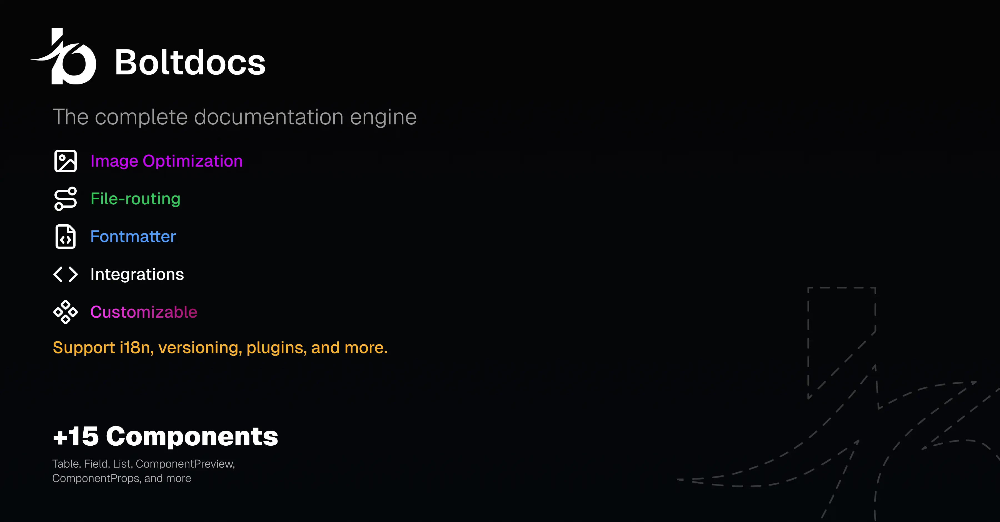

<p align="center">
  
</p>

# Boltdocs

> **The next-generation, high-performance documentation framework powered by React and Vite.**

Boltdocs is a lightning-fast documentation tool designed for developers who value both speed and aesthetics. It combines the power of Vite with a premium, glassmorphism-inspired UI to deliver a seamless documentation experience.

[](https://github.com/bolt-docs/boltdocs)
[](https://opensource.org/licenses/MIT)
[](CONTRIBUTING.md)

## ✨ Features

- 🚀 **Vite-Powered Speed**: Near-instant HMR and production builds.
- 🩺 **Automated Hygiene**: `boltdocs doctor` health checks for broken links and missing translations.
- 🌍 **Native i18n**: Out-of-the-box support for multiple locales and fallback logic.
- 📦 **Modular CLI**: A cleanly structured, extensible command-line interface.
- 💎 **Premium UI**: Modern aesthetics featuring skeleton loaders, glassmorphism, and micro-animations.
- 🧩 **Rich MDX Components**: Built-in interactive components for cards, tabs, link previews, and more.
- 🔄 **SEO Optimized**: Automatic sitemap and robots.txt generation.
- 🏗️ **Monorepo Ready**: Designed to work effortlessly with `pnpm` and `turborepo`.

## 📦 Installation

You can install Boltdocs globally or as a dependency in your project:

### Using NPM
```bash
npm install -g boltdocs
```

### Using PNPM (Recommended)
```bash
pnpm add -g boltdocs
```

### Using Yarn
```bash
yarn global add boltdocs
```

## 🚀 Quick Start

Initialize a new documentation project in seconds:

```bash
# 1. Create your docs directory
mkdir my-docs && cd my-docs

# 2. Add some content
mkdir docs && echo "# Hello Boltdocs" > docs/index.md

# 3. Start the dev server
boltdocs dev
```

## 🩺 Documentation Hygiene (`doctor`)

Ensure your documentation is always healthy before shipping:

```bash
boltdocs doctor
```

The doctor command will check for:
- ❌ **Broken internal links**: Identify links pointing to non-existent files.
- ⚠️ **Missing metadata**: Warn about missing titles in frontmatter.
- ℹ️ **Orphaned translations**: Detect files in your default locale that lack translated counterparts.

## 🛠️ CLI Commands

| Command | Description |
| :--- | :--- |
| `boltdocs dev` | Start the development server with HMR. |
| `boltdocs build` | Build the documentation for production. |
| `boltdocs preview`| Preview the production build locally. |
| `boltdocs doctor` | Run health checks on your documentation project. |

## 🤝 Contributing

We welcome contributions! Whether it's a bug report, a new feature, or a documentation fix, we'd love to have you. Check out our [Contributing Guide](CONTRIBUTING.md) to get started.

## 📄 License

This project is licensed under the MIT License - see the [LICENSE](LICENSE) file for details.

---

<p align="center">
  Built with ❤️ for the documentation community.  
  <b><a href="https://github.com/bolt-docs/boltdocs">GitHub</a></b> • <b><a href="#">Discord</a></b> • <b><a href="#">Twitter</a></b>
</p>
