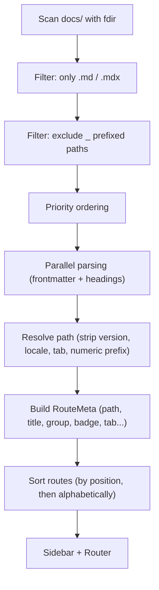

**Your file system is your sitemap.** Every `.md` or `.mdx` file inside `docs/` automatically becomes a page. No route config, no imports — just files.


## Sidebar Groups

Folders automatically create sidebar groups. Every file inside a folder is listed as a child item of that group.

```
docs/
├── index.md              → /docs (no group, first in the sidebar)
├── guide/
│   ├── index.md          → /docs/guide (group header)
│   ├── installation.md   → /docs/guide/installation
│   └── configuration.md  → /docs/guide/configuration
└── api/
    └── config.md         → /docs/api/config
```

The group title defaults to the capitalized folder name (`guide` → `Guide`). Override it with the `groupTitle` frontmatter or `theme.sidebarGroups` in the config.

---

## Controlling Order

### Numeric Filename Prefix

Prefix filenames with a number to control sidebar order. The prefix is stripped from the URL:

```
docs/
├── 01-introduction.md    → /docs/introduction (order: 1)
├── 02-installation.md    → /docs/installation (order: 2)
├── 03-guide/
│   ├── index.md
│   ├── 01-setup.md
│   └── 02-advanced.md
```

### sidebarPosition Frontmatter

Alternatively, set `sidebarPosition` directly in the frontmatter:

```md
---
title: Installation
sidebarPosition: 1
---
```

<Callout variant="note">
  If both a numeric prefix and `sidebarPosition` exist, the frontmatter value takes precedence.
</Callout>

### Grouped vs. Ungrouped Ordering (Interleaving)

Boltdocs merges folder groups and ungrouped pages (like `troubleshooting.mdx` or `index.mdx` located at the root of a tab directory) into a single ordered list:
* **Ungrouped items** use their `sidebarPosition` (defaults to `999` if not set).
* **Folder groups** use the `order` property defined in their `meta.json` file (defaults to `999` if not set).
* Everything is sorted numerically ascending. If positions are identical, links come before groups.

For example, if you set:
* `index.mdx` (Overview) $\rightarrow$ `sidebarPosition: 1`
* `getting-started/` folder $\rightarrow$ `order: 1` in `meta.json`
* `advanced/` folder $\rightarrow$ `order: 2` in `meta.json`
* `troubleshooting.mdx` $\rightarrow$ `sidebarPosition: 20`

They will render in the sidebar in that exact order, keeping `Troubleshooting` pinned at the very bottom.

---

## Excluding Files

Files or folders starting with `_` are **excluded from routing**:

```
docs/
├── _drafts/              ← excluded entirely
│   └── new-feature.md
├── _shared.mdx           ← excluded from routes
└── guide/
    └── index.md          ← included normally
```

**Exception:** `_index.md` acts as an invisible group index to set group-level metadata without creating a visible page.

---

## Tabs

Tabs divide the documentation into horizontal sections above the sidebar. The tab id is determined by wrapping a folder name in parentheses:

```
docs/
├── (guides)/              ← all pages belong to the "guides" tab
│   ├── index.md
│   └── installation.md
├── (api)/                 ← all pages belong to the "api" tab
│   └── config.md
```

The parentheses are **stripped from the URL** — `/docs/guides/getting-started/installation`, not `/docs/(guides)/getting-started/installation`.

### Defining Tabs in Configuration

```ts title="boltdocs.config.ts"
export default defineConfig({
  theme: {
    tabs: [
      { id: 'guides', text: 'Guides', icon: 'BookOpen' },
      { id: 'api', text: 'API', icon: 'Code2' },
      { id: 'changelog', text: 'Changelog', icon: 'History' },
    ],
  },
})
```

### Tab Configuration Reference

| Property | Type | Required | Description |
| :--- | :--- | :--- | :--- |
| **`id`** | `string` | ✓ | Must match the folder name (without parentheses). |
| **`text`** | `string` | ✓ | Label shown in the tab strip. |
| **`icon`** | `string` | — | Lucide icon name or inline SVG. |

### Combining Tabs with i18n

Locale folders go **inside** the tab folders:

```
docs/
├── (guides)/
│   ├── index.md          → /docs/guides (default locale)
│   └── es/
│       └── index.md      → /docs/es/guides (Spanish)
```

---

## Customizing Group Titles and Icons

### Through Configuration

```ts title="boltdocs.config.ts"
export default defineConfig({
  theme: {
    sidebarGroups: {
      guides: {
        title: 'Getting Started',
        icon: 'BookOpen',
      },
    },
  },
})
```

### Through meta.json

Create `meta.json` in any folder:

```json title="docs/guide/meta.json"
{
  "title": "Getting Started",
  "icon": "Rocket",
  "collapsible": true,
  "collapsed": false
}
```

| Property | Type | Description |
| :--- | :--- | :--- |
| **`title`** | `string` | Display name for the sidebar group. |
| **`order`** | `string[] \| number` | Explicit ordering. |
| **`icon`** | `string` | Lucide icon name or inline SVG. |
| **`collapsible`** | `boolean` | Whether users can collapse the group. |
| **`collapsed`** | `boolean` | Whether the group starts collapsed. |

---

## Manual Sidebar

For full control, define the sidebar manually:

```ts title="boltdocs.config.ts"
export default defineConfig({
  theme: {
    sidebar: {
      '/docs/guides': [
        { text: 'Introduction', link: '/docs/guides/getting-started/introduction' },
        { text: 'Installation', link: '/docs/guides/getting-started/installation' },
      ],
    },
  },
})
```

<Callout variant="warning">
  When you define `theme.sidebar` for a prefix, auto-discovery is disabled for that prefix.
</Callout>

---

## Hiding Pages

To keep a page accessible but hidden from the sidebar:

```md title="docs/guide/internal-reference.md"
---
title: Internal Reference
sidebarHidden: true
---
```

Hidden pages are still indexed for search.

---

## Priority Scanning

On startup, Boltdocs prioritizes:
1. `index.*` files
2. Files matching `intro*`
3. Files matching `getting-started*`
4. All other files

---

## How Routes Are Built


