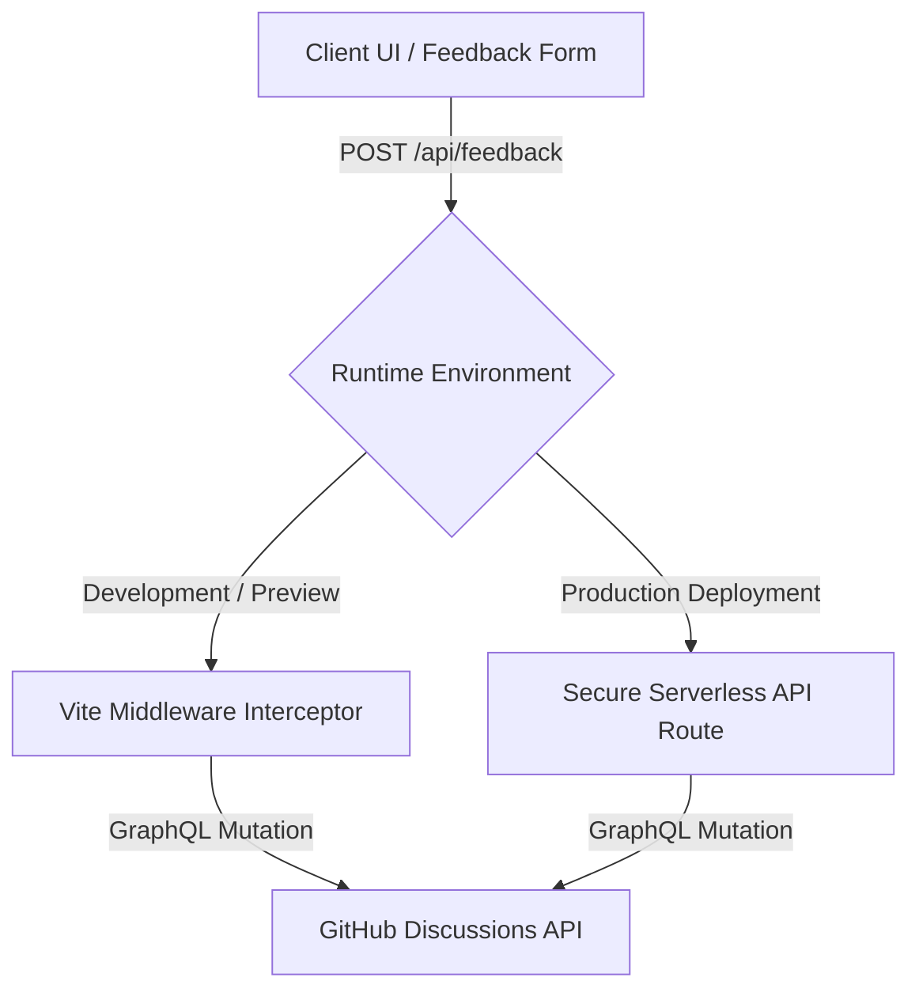

# Custom Feedback Integration

The **Custom Feedback** integration lets you collect feedback ratings (😊, 😐, 🙁) and written suggestions from your readers directly into your **GitHub Discussions** thread record without the overhead of heavy third-party iframe packages.


## How It Works

Boltdocs splits the feedback submission pipeline into a local interceptor and a secure production API handler:



1. **Development and Preview:** When you run `boltdocs dev` or `boltdocs preview`, a built-in server middleware automatically intercepts incoming POST requests to `/api/feedback`, signs a secure GitHub token or JWT, and sends the payload directly to the GitHub GraphQL API.
2. **Production Hosting:** When deployed to a static site host (like Vercel, Netlify, or Cloudflare Pages), there's no Vite server running to handle POST requests. You must deploy a serverless function endpoint to receive the feedback securely.

---

## Quick Scaffolding via `create-boltdocs`

When initializing a new Boltdocs project with the `create-boltdocs` CLI tool, the wizard asks you to choose a deployment target. This can also be passed via the `--deploy` CLI flag (or `-d`):

```bash
# Scaffold a new project configured for Cloudflare Pages
npm create boltdocs@latest my-docs-app -- --template base --deploy cloudflare
```

Depending on your selection, `create-boltdocs` automatically scaffolds the correct functions folder and configuration:
- **Vercel**: Creates `api/feedback.ts`.
- **Netlify**: Creates `netlify/functions/feedback.ts` and redirects inside `netlify.toml`.
- **Cloudflare Pages**: Creates `functions/api/feedback.ts`.
- **AWS Lambda**: Creates `lambda/feedback.ts`.
- **Static Only**: Scaffolds a purely static build without configuring serverless functions.

---

## Production Deployment (Runtime Environments and Adapters)

To securely submit feedback in production without exposing your GitHub credentials to the browser, Boltdocs exports **pre-built runtime adapters** for the major serverless providers.

### 1. Vercel Serverless Functions

To deploy on Vercel, create a file at `api/feedback.ts` in the root of your project:

```ts title="api/feedback.ts"
import { handleVercelFeedback } from 'boltdocs/server'

export default handleVercelFeedback
```

### 2. Cloudflare Workers / Vercel Edge

For Cloudflare Workers, Pages Functions, or Edge environments using the standard web `Request`/`Response` APIs:

```ts title="worker.ts or functions/api/feedback.ts"
import { handleWebFeedback } from 'boltdocs/server'

export default {
  async fetch(request: Request, env: any): Promise<Response> {
    const url = new URL(request.url)
    if (url.pathname === '/api/feedback') {
      return handleWebFeedback(request, env)
    }
    return new Response('Not Found', { status: 404 })
  }
}
```

### 3. Netlify Functions (AWS Lambda)

For AWS Lambda-style serverless handlers on Netlify:

```ts title="netlify/functions/feedback.ts"
import { handleNetlifyFeedback } from 'boltdocs/server'

export const handler = async (event: any) => {
  return handleNetlifyFeedback(event, process.env)
}
```

---

## Environment Variable Configuration

The production API handlers securely parse GitHub authentication keys from your host's environment variables. Make sure the following keys are configured in your hosting provider's panel:

| Variable | Description |
| :--- | :--- |
| **`BOLTDOCS_GITHUB_TOKEN`** | A personal access token (PAT) with `write` permission for repository discussions. |
| **`BOLTDOCS_GITHUB_REPO_OWNER`** | Overrides the owner/organization name of the GitHub repository. |
| **`BOLTDOCS_GITHUB_REPO_NAME`** | Overrides the name of the GitHub repository. |

If you're using a **GitHub App** for authentication, define these variables instead:

| Variable | Description |
| :--- | :--- |
| **`GITHUB_APP_ID`** | The unique App ID generated by GitHub. |
| **`GITHUB_PRIVATE_KEY`** | The RSA private key of your GitHub App (with escaped newlines). |
| **`GITHUB_INSTALLATION_ID`** | The installation ID for the target repository. |

---

## Visual Presentation

Once enabled, Boltdocs automatically injects premium glass-effect feedback forms at the bottom of standard documentation pages:

```md
Was this page helpful? [ Yes ]  [ Regular ]  [ No ]
```

And thumb up/down feedback elements directly next to the **Copy** action inside code block headers.

### Custom React Designs (`useFeedback`)

If you want to build your own custom feedback UI, import and use the lightweight client-side `useFeedback` hook:

```tsx
import { useFeedback } from 'boltdocs/client'

export function MyFeedbackComponent() {
  const { rating, setRating, comment, setComment, loading, submitted, submit, error } = useFeedback()

  if (submitted) {
    return <p>Thanks for your help!</p>
  }

  return (
    <div>
      <h4>Was this page useful?</h4>
      <button onClick={() => { setRating('good'); submit() }}>Yes</button>
      <button onClick={() => { setRating('bad'); submit() }}>No</button>
    </div>
  )
}
```
