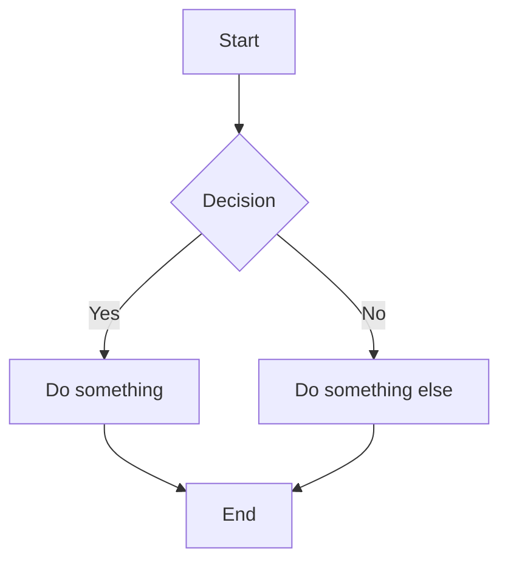

import { Field, Note, Tip } from 'boltdocs/client'

# Mermaid Plugin

`@boltdocs/plugin-mermaid` adds native support for [Mermaid](https://mermaid.js.org/) diagrams in your documentation. Write diagram syntax inside standard code blocks tagged as `mermaid`, and they're automatically rendered as interactive SVGs.

---

## Installation

```bash
pnpm add @boltdocs/plugin-mermaid
```

---

## Configuration

Register the plugin in your `boltdocs.config.ts`:

```ts
import { defineConfig } from 'boltdocs'
import mermaidPlugin from '@boltdocs/plugin-mermaid'

export default defineConfig({
  plugins: [mermaidPlugin()],
})
```

That's it. No additional configuration needed.

---

## Usage

Write Mermaid syntax inside a fenced code block with the `mermaid` language tag:

````markdown

````


The diagram is rendered as an interactive SVG at build time, with no manual component imports required.

---

## How It Works

The plugin consists of two parts:

### 1. Remark Plugin (Build Time)

A remark transform (`remarkMermaid`) scans the Markdown AST for code blocks with `lang: 'mermaid'`. It replaces each one with a `<Mermaid chart="..." />` JSX element.

### 2. React Component (Client Side)

The `Mermaid` component receives the raw chart syntax and uses the Mermaid library to render it as SVG in the browser.

```tsx
// This happens automatically — you never import it manually
<Mermaid chart={`graph TD; A-->B; B-->C;`} />
```

---

## Component Props

<Field name="chart" type="string" required>
  The raw Mermaid diagram syntax to render.
</Field>

---

## Theme Integration

The Mermaid component uses Boltdocs' CSS variables for consistent styling:

```ts
{
  primaryColor: '#f3f4f6',
  primaryTextColor: '#111827',
  primaryBorderColor: '#d1d5db',
  lineColor: '#6b7280',
  fontFamily: 'var(--font-sans)',
}
```

Dark mode is detected automatically from the `dark` class on `<html>`.

---

## Supported Diagram Types

Any diagram type supported by Mermaid works:

- Flowcharts (`graph TD`)
- Sequence diagrams (`sequenceDiagram`)
- Class diagrams (`classDiagram`)
- State diagrams (`stateDiagram-v2`)
- Entity Relationship diagrams (`erDiagram`)
- Gantt charts (`gantt`)
- Pie charts (`pie`)
- Git graph (`gitGraph`)
- And more — see the [Mermaid documentation](https://mermaid.js.org/intro/)

<Note>
  If a diagram fails to parse, the component displays a "Failed to render diagram" fallback message and logs the error to the console.
</Note>
