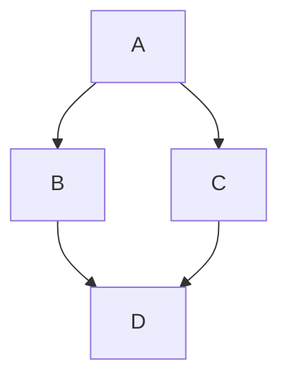

# Plugin System

Because LiteDocs is architected as a thin wrapper around **Vite**, its plugin system is incredibly powerful. You hook directly into the Vite build lifecycle to transform Markdown into compiled React components and file-routing definitions.

## Existing Architecture 

LiteDocs internally runs several sub-plugins that manage core features:
- **Routing Plugin**: Crawls your `docs/` folder to build a manifest of pages.
- **HTML Document Injector**: Injects necessary `index.html` structure automatically during development servers and production SSR.
- **Entry Plugin**: Uses virtual modules to dynamically resolve client-side hydration endpoints `virtual:boltdocs-entry-client` and `virtual:boltdocs-entry-server`.

## Creating Custom Plugins

To add custom behavior, you simply write a standard Vite plugin and add it to your `vite.config.ts`. If you want to interact closely with the internal router state, LiteDocs exposes context hooks.

```ts
// Example: Custom Vite plugin adding a global variable
import type { Plugin } from 'vite';

export function myCustomPlugin(): Plugin {
  return {
    name: 'boltdocs-custom-plugin',
    config(config) {
      return {
        define: {
          __MY_CUSTOM_VARIABLE__: JSON.stringify('Hello World')
        }
      };
    }
  };
}
```

Then in `vite.config.ts`:

```ts
import { defineConfig } from 'vite';
import boltdocs from 'boltdocs';
import { myCustomPlugin } from './my-custom-plugin';

export default defineConfig({
  plugins: [
    boltdocs(),
    myCustomPlugin()
  ]
});
```

Because LiteDocs is just an abstraction over Vite's configuration, any existing Vite plugin (Tailwind, Unocss, Image Minifiers) will work seamlessly alongside the framework!

---

## Official Plugins

LiteDocs maintains a set of official plugins to extend the capabilities of your documentation.

### `boltdocs-plugin-mermaid`

This plugin adds native support for rendering [Mermaid](https://mermaid.js.org/) diagrams directly from Markdown code blocks. It runs as a `remark` plugin to transform your syntax efficiently into a React component.

#### Installation

Install the package via your favorite package manager:

```bash
pnpm install @boltdocs/plugin-mermaid
```

#### Configuration

Add the plugin to your `boltdocs.config.js` or `boltdocs.config.ts`:

```js
// boltdocs.config.js
import mermaidPlugin from '@boltdocs/plugin-mermaid';

export default {
  // ... other options
  plugins: [
    mermaidPlugin()
  ]
}
```

#### Usage

Once registered, you can write Mermaid syntax inside standard Markdown code blocks by tagging the language as `mermaid`.

The following Markdown:

````markdown

````

Will be automatically converted and rendered as an interactive SVG diagram in your documentation pages! You don't need to import any components manually.
