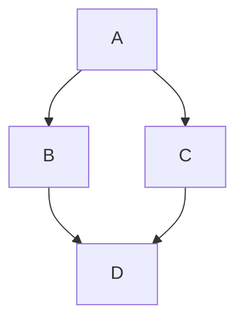

import { Field } from 'boltdocs/client'

# Plugin System

Boltdocs is designed to be lean and fast, but it doesn't sacrifice power. Because it's built directly on **Vite**, you have access to a world-class plugin ecosystem. You can easily extend the build process to transform content, inject custom logic, or integrate with third-party tools.

## How it Works

Under the hood, Boltdocs uses a modular architecture where even core features are implemented as plugins. This means you have the power to:
- **Transform Markdown**: Hook into the build process to change how your docs are compiled.
- **Dynamic Routing**: Customize how files are discovered and mapped to URLs.
- **Virtual Modules**: Inject dynamic data or code into your client-side application.

## Customizing Your Workflow

Adding custom behavior is straightforward. Since Boltdocs is "just Vite," any standard Vite plugin will work out of the box. If you need deeper integration, like accessing the internal router state, we provide dedicated context hooks.

```ts
// Example: Custom Vite plugin adding a global variable
import type { Plugin } from 'vite';

export function myCustomPlugin(): Plugin {
  return {
    name: 'boltdocs-custom-plugin',
    config(config) {
      return {
        define: {
          __MY_CUSTOM_VARIABLE__: JSON.stringify('Hello World')
        }
      };
    }
  };
}
```

Then in `vite.config.ts`:

```ts
import { defineConfig } from 'vite';
import boltdocs from 'boltdocs';
import { myCustomPlugin } from './my-custom-plugin';

export default defineConfig({
  plugins: [
    boltdocs(),
    myCustomPlugin()
  ]
});
```

Because Boltdocs is just an abstraction over Vite's configuration, any existing Vite plugin (Tailwind, Unocss, Image Minifiers) will work seamlessly alongside the framework!

---

## `BoltdocsPlugin` Interface

Each plugin in the `plugins` array conforms to the `BoltdocsPlugin` interface:

<Field name="name" type="string" required>
  A unique identifier for the plugin. Used for debugging and deduplication.
</Field>

<Field name="enforce" type='"pre" | "post"'>
  Controls execution order. `"pre"` plugins run before the core pipeline, `"post"` plugins run after.
</Field>

<Field name="remarkPlugins" type="any[]">
  An array of Remark plugins to inject into the MDX parsing pipeline. Operates on the Markdown AST before it becomes HTML.
</Field>

<Field name="rehypePlugins" type="any[]">
  An array of Rehype plugins to inject into the MDX pipeline. Operates on the HTML AST after Markdown has been parsed.
</Field>

<Field name="vitePlugins" type="VitePlugin[]">
  Standard Vite plugins to inject into the build. This allows deep integration with Vite's build pipeline.
</Field>

<Field name="components" type="Record<string, string>">
  A map of component `Name` → `Module Path` to globally inject React components into all MDX files without manual imports.
</Field>

---

## Official Plugins

Boltdocs maintains a set of official plugins to extend the capabilities of your documentation.

### `boltdocs-plugin-mermaid`

This plugin adds native support for rendering [Mermaid](https://mermaid.js.org/) diagrams directly from Markdown code blocks. It runs as a `remark` plugin to transform your syntax efficiently into a React component.

#### Installation

Install the package via your favorite package manager:

```bash
pnpm install @boltdocs/plugin-mermaid
```

#### Configuration

Add the plugin to your `boltdocs.config.js` or `boltdocs.config.ts`:

```js
// boltdocs.config.js
import mermaidPlugin from '@boltdocs/plugin-mermaid';

export default {
  // ... other options
  plugins: [
    mermaidPlugin()
  ]
}
```

#### Usage

Once registered, you can write Mermaid syntax inside standard Markdown code blocks by tagging the language as `mermaid`.

The following Markdown:

````markdown

````

Will be automatically converted and rendered as an interactive SVG diagram in your documentation pages! You don't need to import any components manually.
