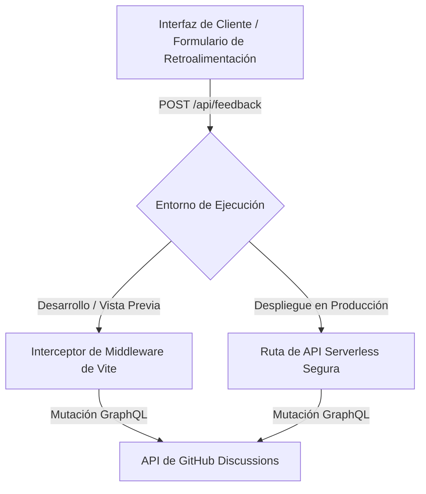

# Integración de Retroalimentación Personalizada

La integración de **Retroalimentación Personalizada** te permite recopilar calificaciones de retroalimentación (😊, 😐, 🙁) y sugerencias escritas de tus lectores directamente en tu registro de hilos de **GitHub Discussions** sin la sobrecarga de paquetes de iframes pesados de terceros.

---

## Configuración Mínima

Para habilitar la retroalimentación personalizada, registra las coordenadas de tu repositorio de GitHub en la sección `integrations` de tu archivo de configuración:

```ts title="boltdocs.config.ts"
import { defineConfig } from 'boltdocs'

export default defineConfig({
  integrations: {
    feedback: {
      custom: {
        enabled: true,
        owner: 'your-github-username-or-org',
        repo: 'your-repository-name',
        categorySlug: 'general', // Opcional: predeterminado a 'general'
      },
    },
  },
})
```

---

## Cómo Funciona

Boltdocs divide la canalización de envío de retroalimentación en un interceptor local y un manejador seguro de API de producción:



1. **Desarrollo y Vista Previa:** Cuando ejecutas `boltdocs dev` o `boltdocs preview`, un middleware de servidor incorporado intercepta automáticamente las solicitudes POST entrantes a `/api/feedback`, firma un token GitHub seguro o JWT, y envía el payload directamente a la API GraphQL de GitHub.
2. **Hosting en Producción:** Cuando se despliega en un host de sitio estático (como Vercel, Netlify o Cloudflare Pages), no hay un servidor Vite ejecutándose para manejar solicitudes POST. Debes desplegar un endpoint de función serverless para recibir la retroalimentación de forma segura.

---

## Andamiaje Rápido mediante `create-boltdocs`

Al inicializar un nuevo proyecto de Boltdocs con la herramienta CLI `create-boltdocs`, el asistente te pregunta para elegir un objetivo de despliegue. Esto también se puede pasar mediante la bandera CLI `--deploy` (o `-d`):

```bash
# Andamiaje un nuevo proyecto configurado para Cloudflare Pages
npm create boltdocs@latest my-docs-app -- --template base --deploy cloudflare
```

Dependiendo de tu selección, `create-boltdocs` andamiaje automáticamente la carpeta de funciones y configuración correcta:
- **Vercel**: Crea `api/feedback.ts`.
- **Netlify**: Crea `netlify/functions/feedback.ts` y redirecciones dentro de `netlify.toml`.
- **Cloudflare Pages**: Crea `functions/api/feedback.ts`.
- **AWS Lambda**: Crea `lambda/feedback.ts`.
- **Solo Estático**: Andamiaje una compilación puramente estática sin configurar funciones serverless.

---

## Despliegue en Producción (Entornos de Ejecución y Adaptadores)

Para enviar retroalimentación de forma segura en producción sin exponer tus credenciales de GitHub al navegador, Boltdocs exporta **adaptadores de entorno de ejecución** pre-compilados para los principales proveedores serverless.

### 1. Funciones Serverless de Vercel

Para desplegar en Vercel, crea un archivo en `api/feedback.ts` en la raíz de tu proyecto:

```ts title="api/feedback.ts"
import { handleVercelFeedback } from 'boltdocs/server'

export default handleVercelFeedback
```

### 2. Cloudflare Workers / Vercel Edge

Para Cloudflare Workers, Pages Functions o entornos Edge que utilizan las APIs web estándar `Request`/`Response`:

```ts title="worker.ts or functions/api/feedback.ts"
import { handleWebFeedback } from 'boltdocs/server'

export default {
  async fetch(request: Request, env: any): Promise<Response> {
    const url = new URL(request.url)
    if (url.pathname === '/api/feedback') {
      return handleWebFeedback(request, env)
    }
    return new Response('Not Found', { status: 404 })
  }
}
```

### 3. Funciones Netlify (AWS Lambda)

Para manejadores serverless estilo AWS Lambda en Netlify:

```ts title="netlify/functions/feedback.ts"
import { handleNetlifyFeedback } from 'boltdocs/server'

export const handler = async (event: any) => {
  return handleNetlifyFeedback(event, process.env)
}
```

---

## Configuración de Variables de Entorno

Los manejadores de API de producción analizan de forma segura las claves de autenticación de GitHub desde las variables de entorno de tu host. Asegúrate de que las siguientes claves estén configuradas en el panel de tu proveedor de hosting:

| Variable | Descripción |
| :--- | :--- |
| **`BOLTDOCS_GITHUB_TOKEN`** | Un token de acceso personal (PAT) con permiso de `write` para discusiones del repositorio. |
| **`BOLTDOCS_GITHUB_REPO_OWNER`** | Sobrescribe el nombre del propietario/organización del repositorio de GitHub. |
| **`BOLTDOCS_GITHUB_REPO_NAME`** | Sobrescribe el nombre del repositorio de GitHub. |

Si estás usando una **GitHub App** para autenticación, define estas variables en su lugar:

| Variable | Descripción |
| :--- | :--- |
| **`GITHUB_APP_ID`** | El ID único de la App generado por GitHub. |
| **`GITHUB_PRIVATE_KEY`** | La clave privada RSA de tu GitHub App (con saltos de línea escapados). |
| **`GITHUB_INSTALLATION_ID`** | El ID de instalación para el repositorio objetivo. |

---

## Presentación Visual

Una vez habilitada, Boltdocs inyecta automáticamente formularios de retroalimentación premium con efecto de vidrio en la parte inferior de las páginas de documentación estándar:

```md
Was this page helpful? [ Yes ]  [ Regular ]  [ No ]
```

Y elementos de retroalimentación con pulgar arriba/abajo directamente junto a la acción **Copiar** dentro de los encabezados de bloques de código.

### Diseños React Personalizados (`useFeedback`)

Si deseas construir tu propia interfaz de retroalimentación personalizada, importa y utiliza el hook ligero `useFeedback` del lado del cliente:

```tsx
import { useFeedback } from 'boltdocs/client'

export function MyFeedbackComponent() {
  const { rating, setRating, comment, setComment, loading, submitted, submit, error } = useFeedback()

  if (submitted) {
    return <p>Thanks for your help!</p>
  }

  return (
    <div>
      <h4>Was this page useful?</h4>
      <button onClick={() => { setRating('good'); submit() }}>Yes</button>
      <button onClick={() => { setRating('bad'); submit() }}>No</button>
    </div>
  )
}
```