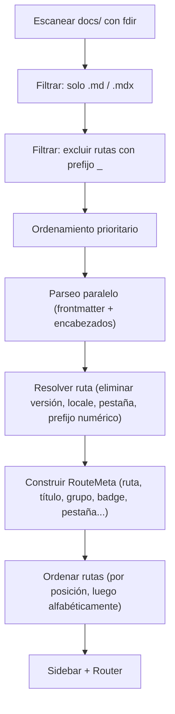

**Tu sistema de archivos es tu mapa del sitio.** Cada archivo `.md` o `.mdx` dentro de `docs/` se convierte automáticamente en una página. Sin configuración de rutas, sin imports — solo archivos.


## Grupos del Sidebar

Las carpetas crean automáticamente grupos en el sidebar. Cada archivo dentro de una carpeta se lista como un elemento hijo de ese grupo.

```
docs/
├── index.md              → /docs (sin grupo, primero en el sidebar)
├── guide/
│   ├── index.md          → /docs/guide (encabezado del grupo)
│   ├── installation.md   → /docs/guide/installation
│   └── configuration.md  → /docs/guide/configuration
└── api/
    └── config.md         → /docs/api/config
```

El título del grupo usa por defecto el nombre de la carpeta capitalizado (`guide` → `Guide`). Sobreescribe con frontmatter `groupTitle` o `theme.sidebarGroups` en la configuración.

---

## Controlando el Orden

### Prefijo Numérico en Nombre de Archivo

Prefija los nombres de archivo con un número para controlar el orden en el sidebar. El prefijo se elimina de la URL:

```
docs/
├── 01-introduction.md    → /docs/introduction (orden: 1)
├── 02-installation.md    → /docs/installation (orden: 2)
├── 03-guide/
│   ├── index.md
│   ├── 01-setup.md
│   └── 02-advanced.md
```

### Frontmatter sidebarPosition

Alternativamente, establece `sidebarPosition` directamente en el frontmatter:

```md
---
title: Installation
sidebarPosition: 1
---
```

<Callout variant="note">
  Si existe tanto un prefijo numérico como `sidebarPosition`, el valor del frontmatter tiene precedencia.
</Callout>

### Ordenamiento de Grupos vs. Sin Grupo (Interleaving)

Boltdocs fusiona grupos de carpetas y páginas sin grupo (como `troubleshooting.mdx` o `index.mdx` ubicados en la raíz de un directorio de pestaña) en una lista ordenada:
* **Elementos sin grupo** usan su `sidebarPosition` (por defecto `999` si no se establece).
* **Grupos de carpetas** usan la propiedad `order` definida en su archivo `meta.json` (por defecto `999` si no se establece).
* Todo se ordena numéricamente de forma ascendente. Si las posiciones son idénticas, los enlaces aparecen antes que los grupos.

Por ejemplo, si estableces:
* `index.mdx` (Descripción General) $\rightarrow$ `sidebarPosition: 1`
* Carpeta `getting-started/` $\rightarrow$ `order: 1` en `meta.json`
* Carpeta `advanced/` $\rightarrow$ `order: 2` en `meta.json`
* `troubleshooting.mdx` $\rightarrow$ `sidebarPosition: 20`

Se renderizarán en el sidebar en ese orden exacto, manteniendo `Troubleshooting` al fondo absoluto.

---

## Excluyendo Archivos

Archivos o carpetas que empiezan con `_` se **excluyen del enrutamiento**:

```
docs/
├── _drafts/              ← excluido completamente
│   └── new-feature.md
├── _shared.mdx           ← excluido de las rutas
└── guide/
    └── index.md          ← incluido normalmente
```

**Excepción:** `_index.md` actúa como un índice de grupo invisible para establecer metadatos de nivel de grupo sin crear una página visible.

---

## Pestañas

Las pestañas dividen la documentación en secciones horizontales sobre el sidebar. El ID de la pestaña se determina envolviendo el nombre de una carpeta entre paréntesis:

```
docs/
├── (guides)/              ← todas las páginas pertenecen a la pestaña "guides"
│   ├── index.md
│   └── installation.md
├── (api)/                 ← todas las páginas pertenecen a la pestaña "api"
│   └── config.md
```

Los paréntesis se **eliminan de la URL** — `/docs/guides/getting-started/installation`, no `/docs/(guides)/getting-started/installation`.

### Definiendo Pestañas en Configuración

```ts title="boltdocs.config.ts"
export default defineConfig({
  theme: {
    tabs: [
      { id: 'guides', text: 'Guides', icon: 'BookOpen' },
      { id: 'api', text: 'API', icon: 'Code2' },
      { id: 'changelog', text: 'Changelog', icon: 'History' },
    ],
  },
})
```

### Referencia de Configuración de Pestañas

| Propiedad | Tipo | Requerido | Descripción |
| :--- | :--- | :--- | :--- |
| **`id`** | `string` | ✓ | Debe coincidir con el nombre de la carpeta (sin paréntesis). |
| **`text`** | `string` | ✓ | Etiqueta mostrada en la franja de pestañas. |
| **`icon`** | `string` | — | Nombre de icono de Lucide o SVG directo. |

### Combinando Pestañas con i18n

Las carpetas de locale van **dentro** de las carpetas de pestañas:

```
docs/
├── (guides)/
│   ├── index.md          → /docs/guides (locale por defecto)
│   └── es/
│       └── index.md      → /docs/es/guides (español)
```

---

## Personalizando Títulos e Iconos de Grupos

### A través de Configuración

```ts title="boltdocs.config.ts"
export default defineConfig({
  theme: {
    sidebarGroups: {
      guides: {
        title: 'Primeros Pasos',
        icon: 'BookOpen',
      },
    },
  },
})
```

### A través de meta.json

Crea `meta.json` en cualquier carpeta:

```json title="docs/guide/meta.json"
{
  "title": "Primeros Pasos",
  "icon": "Rocket",
  "collapsible": true,
  "collapsed": false
}
```

| Propiedad | Tipo | Descripción |
| :--- | :--- | :--- |
| **`title`** | `string` | Nombre de visualización para el grupo del sidebar. |
| **`order`** | `string[] \| number` | Ordenamiento explícito. |
| **`icon`** | `string` | Nombre de icono de Lucide o SVG directo. |
| **`collapsible`** | `boolean` | Si los usuarios pueden plegar el grupo. |
| **`collapsed`** | `boolean` | Si el grupo inicia colapsado. |

---

## Sidebar Manual

Para control completo, define el sidebar manualmente:

```ts title="boltdocs.config.ts"
export default defineConfig({
  theme: {
    sidebar: {
      '/docs/guides': [
        { text: 'Introduction', link: '/docs/guides/getting-started/introduction' },
        { text: 'Installation', link: '/docs/guides/getting-started/installation' },
      ],
    },
  },
})
```

<Callout variant="warning">
  Cuando defines `theme.sidebar` para un prefijo, el auto-descubrimiento se deshabilita para ese prefijo.
</Callout>

---

## Ocultando Páginas

Para mantener una página accesible pero oculta del sidebar:

```md title="docs/guide/internal-reference.md"
---
title: Internal Reference
sidebarHidden: true
---
```

Las páginas ocultas siguen indexadas para búsqueda.

---

## Escaneo Prioritario

Al iniciar, Boltdocs prioriza:
1. Archivos `index.*`
2. Archivos que coincidan con `intro*`
3. Archivos que coincidan con `getting-started*`
4. Todos los demás archivos

---

## Cómo Se Construyen las Rutas


