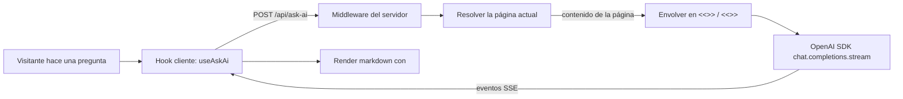

*El plugin `@bdocs/plugin-ask-ai` añade una burbuja de chat flotante y un panel lateral complementario a tu sitio Boltdocs. El asistente responde **solo** usando la página de documentación que el visitante está leyendo actualmente — nunca conocimiento general — y rechaza preguntas que no estén fundamentadas en los docs.*

<Callout variant="info" title="Respuestas con alcance de página, no Q&A general">
  Este es un asistente de Q&A de documentación, no un chatbot. El asistente responderá con `Not in docs.` (No está en los docs.) si la pregunta no puede responderse desde la página actual. Combínalo con `secretKey` y un reverse proxy para deployments de producción — consulta [Modelo de Seguridad](#modelo-de-seguridad) más abajo.
</Callout>


## Conceptos y Arquitectura

El plugin es un **pipeline de tres niveles** que se ejecuta completamente dentro del servidor dev/preview de Boltdocs y un middleware delgado que se sitúa frente a cualquier host desplegado:



### 1. Cliente (`@bdocs/plugin-ask-ai/client`)

- **`useAskAi()`** — Hook de React que posee el estado del chat, el lector SSE del stream y el `AbortController` cooperativo. Devuelve `messages`, `input`, `isLoading`, `submitQuestion`, `stopStreaming`, `clearChat`, `isOpen`, `setIsOpen`.
- **`<AskAiBubble />`** — botón flotante auto-inyectado + diálogo emergente (esquina inferior derecha en cada página).
- **`<AskAiDialog />`** — companion de sidebar auto-inyectado en viewports `xl:` (≥ 1280 px).
- **`<MarkdownRenderer />`** — wrapper delgado de `Streamdown` que activa `parseIncompleteMarkdown` por defecto para una visualización de streaming fluida y sin parpadeos.

El hook también escucha eventos globales para que otras partes de tu sitio puedan manejarlo:

```ts
window.dispatchEvent(new CustomEvent('boltdocs:ask-ai:toggle'))
window.dispatchEvent(new CustomEvent('boltdocs:ask-ai:open'))
window.dispatchEvent(new CustomEvent('boltdocs:ask-ai:close'))
```

### 2. Middleware del servidor (`POST /api/ask-ai`)

Un middleware de `vite` montado sobre `dev` y `preview`. Este:

1. Lee el contenido de la página renderizada (Vite dev) **o** acepta `{ page, content }` pre-extraído del cliente (modo adaptador serverless).
2. Valida la pregunta contra los caps configurados y la denylist.
3. Envuelve el contenido de la página en marcadores `<<<DOCS_START>>>` / `<<<DOCS_END>>>` — y **escapa las ocurrencias literales de esos tokens dentro de la página** para que un autor de MDX no pueda romper la frontera.
4. Hace streaming de eventos `chat.completions.create({ stream: true })` de vuelta como Server-Sent Events (`text/event-stream`).

### 3. Capa LLM

El SDK oficial `openai` (`^4.77.0`). Todas las demás piezas del plugin se construyen alrededor de cuatro garantías:

- Cualquier proveedor que hable `/v1/chat/completions` funciona mediante `baseURL`.
- `AbortController` está cableado hasta abajo, por lo que cerrar la pestaña mid-stream detiene inmediatamente la solicitud upstream (sin gasto huérfano de tokens).
- Un timeout interno de 60 segundos aborta el stream incluso si el cliente nunca se desconecta.
- El output está limitado en el SDK por `max_tokens` — los costes descontrolados están acotados incluso si todas las demás protecciones degradan.

---

## Configuración

### Opciones del Plugin

Todas las opciones son opcionales. Pásalas al inicializador `askAiPlugin()` en `boltdocs.config.ts`:

```ts
askAiPlugin({
  model: 'gpt-4o-mini',
  endpoint: '/api/ask-ai',
  baseURL: undefined,
  systemPrompt: undefined,
  maxInputChars: 2_000,
  maxOutputTokens: 600,
  contextChars: 6_000,
  rateLimitPerMinute: 30,
  secretKey: undefined,
  customModels: [],
})
```

| Propiedad | Tipo | Predeterminado | Descripción |
| :--- | :--- | :--- | :--- |
| **`model`** | `'gpt-4o-mini' \| 'gpt-4.1-mini' \| 'gpt-4.1-nano'` | `'gpt-4o-mini'` | Modelo built-in. Si necesitas otro modelo, listalo en `customModels` y añádelo a la `modelAllowlist`. |
| **`endpoint`** | `string` | `'/api/ask-ai'` | Ruta del middleware de Vite. Solo POST. Cualquier otro método devuelve 404 por diseño. |
| **`baseURL`** | `string` (validada como URL) | `undefined` | URL base de la API OpenAI-compatible. Cae al env var `OPENAI_BASE_URL` → OpenAI. |
| **`systemPrompt`** | `string` | `DEFAULT_SYSTEM_PROMPT` | Override del prompt de seguridad. **Override solo si entiendes el modelo de seguridad** — consulta [Capa 4](#modelo-de-seguridad). Para resetear al predeterminado, pon `systemPrompt: undefined`. |
| **`maxInputChars`** | `number` (1–20 000) | `2_000` | Cap duro sobre la pregunta del usuario antes de llegar a OpenAI. |
| **`maxOutputTokens`** | `number` (1–4 000) | `600` | Cap duro sobre los tokens de completion, aplicado por el SDK. |
| **`contextChars`** | `number` (1–40 000) | `6_000` | Máximo de caracteres del contenido de la página enviado. Las páginas largas se truncan silenciosamente. |
| **`rateLimitPerMinute`** | `number` (≥ 0) | `30` | Peticiones por minuto por IP. Pon `0` para desactivar (no recomendado en deployments abiertos). |
| **`secretKey`** | `string` (≥ 8 caracteres) | `undefined` | Secreto compartido requerido. Los llamantes deben incluir `?secret=<key>` o el header `x-boltdocs-ask-ai-key: <key>`. Cualquier otro origen recibe `UNAUTHORIZED`. |
| **`customModels`** | `string[]` (≤ 20 entradas, ≤ 120 caracteres cada una) | `[]` | Comodín para usuarios avanzados. Añade nombres de modelos a la allowlist runtime sin tocar el schema. |

> Las páginas que excedan `contextChars` se truncan al inicio. Si necesitas usar la última sección de un documento largo, plantéate exponer un punto de anclaje o dividir el contenido en piezas más pequeñas.

### Variables de Entorno

| Variable | Requerida | Predeterminada | Descripción |
| :--- | :--- | :--- | :--- |
| **`OPENAI_API_KEY`** | sí | — | API key del proveedor upstream. El middleware rehúsa hacer streaming si no está establecida. |
| **`OPENAI_BASE_URL`** | no | OpenAI | Override para la URL base de la API. Equivalente a `baseURL` en las opciones del plugin (las opciones tienen precedencia). |

`OPENAI_API_KEY` se lee al momento de la petición, por lo que puedes rotar keys sin reiniciar el servidor de desarrollo. Para secretos en producción, móntalo mediante el gestor de env vars de tu plataforma (Vercel project env, AWS Secrets Manager, etc.) — nunca lo commitees.

---

## Modelos Soportados

### Allowlist built-in

Modelos empaquetados en el schema, elegidos por su equilibrio precio/calidad en Q&A de documentación:

| Modelo | Tier | Caso de uso |
| :--- | :--- | :--- |
| `gpt-4o-mini` (predeterminado) | barato | Mayoría de Q&A sobre docs. Estable y bien de precio. |
| `gpt-4.1-mini` | bajo | Mejor razonamiento que `gpt-4o-mini` con latencia similar. |
| `gpt-4.1-nano` | muy barato | Deployments de alto volumen. Acepta menor accuracy. |

```ts
askAiPlugin({ model: 'gpt-4.1-mini' })
```

### Escape hatch — `customModels`

Cualquier nombre de modelo que tu cuenta o proveedor pueda hospedar puede agregarse sin tocar el schema:

```ts
askAiPlugin({
  model: 'gpt-4o',
  customModels: ['gpt-4o', 'gpt-4.1', 'o1-mini', 'o4-mini', 'gpt-5'],
})
```

La allowlist runtime es `ALLOWED_MODELS ∪ customModels`. Cualquier valor fuera de esa unión cae silenciosamente a `gpt-4o-mini`.

---

## Proveedores Soportados

El plugin usa el SDK oficial `openai` de Node (v4+). Cualquier proveedor que exponga un endpoint OpenAI-compatible `/v1/chat/completions` funciona. Configúralo con `baseURL` en las opciones del plugin o `OPENAI_BASE_URL` en el entorno.

| Proveedor | Ejemplo `baseURL` | Notas |
| :--- | :--- | :--- |
| **OpenAI** (predeterminado) | `https://api.openai.com/v1` | Se usa cuando `baseURL` no está establecido. |
| **Groq** | `https://api.groq.com/openai/v1` | Inferencia rápida con Llama 3, Mixtral. Key emitida por Groq. |
| **OpenRouter** | `https://openrouter.ai/api/v1` | Agregador: Claude, Gemini, Mistral, etc. Pasa cualquier nombre de modelo que OpenRouter reconozca. |
| **Together AI** | `https://api.together.xyz/v1` | Flota open-source. |
| **Azure OpenAI** | `https://<resource>.openai.azure.com/openai/deployments/<dep>/v1` | El endpoint varía por deployment. |
| **Self-hosted OpenAI-compatible** (llama.cpp, vLLM, LM Studio, Ollama + OpenAI shim, vLLM `--openai-compatible`) | `http://localhost:<puerto>/v1` | El servidor debe exponer `/v1/chat/completions`. |

### No soportados (explícitamente)

- **Anthropic Claude API** — forma de request/response distinta. El plugin solo conoce la spec de OpenAI.
- **Google Gemini API** — forma distinta.
- **Servidores de modelos locales que no hablan el shim de OpenAI** (Ollama `/api/generate` raw, llama.cpp `/completion`).
- **Function-calling / tools use / structured outputs / speech-to-text / image inputs.** Solo chat completions puro.

---

## Ejemplos de Uso

### Configuración mínima

```ts title="boltdocs.config.ts"
import askAiPlugin from '@bdocs/plugin-ask-ai'

export default {
  plugins: [askAiPlugin()],
}
```

### Cambiar a un modelo más potente

```ts
askAiPlugin({
  model: 'gpt-4.1-mini',
  maxOutputTokens: 800,   // permite respuestas más largas
})
```

### Usar un proveedor distinto de OpenAI

```ts
askAiPlugin({
  baseURL: 'https://api.groq.com/openai/v1',
  customModels: ['llama-3.3-70b-versatile'],
  model: 'llama-3.3-70b-versatile',
})
```

```bash title=".env"
OPENAI_API_KEY=gsk_...    # Groq emite esto
```

### Asegurar un deployment de producción

```ts
askAiPlugin({
  secretKey: process.env.BOLTDOCS_ASK_AI_SECRET,
  rateLimitPerMinute: 10,
  maxOutputTokens: 400,
})
```

Caddy / nginx / Cloudflare / Vercel deben establecer `x-forwarded-for` desde una fuente confiable. Combinado con `secretKey`, un atacante no puede saltarse el limiter ni enviar payloads `context` falsificados.

### Componer manualmente (sin auto-injection)

```ts title="boltdocs.config.ts"
askAiPlugin({ autoInject: false })
```

Luego, en tu layout personalizado:

```tsx title="src/layout.tsx"
import { AskAiBubble } from '@bdocs/plugin-ask-ai/client'

export default function Layout() {
  return (
    <div className="min-h-screen">
      {/* …tu nav y contenido a pantalla completa… */}
      <AskAiBubble />
      {/* O <AskAiDialog /> — tú decides */}
    </div>
  )
}
```

### Manejar el chat desde un botón en otro lugar

```tsx
import { useAskAi } from '@bdocs/plugin-ask-ai/client'

export function HelpButton() {
  const { setIsOpen, submitQuestion } = useAskAi()
  return (
    <button
      onClick={() => {
        setIsOpen(true)
        submitQuestion('Guíame a través de esta página')
      }}
    >
      Ayuda
    </button>
  )
}
```

---

## Composición Manual de Componentes

El plugin **no** auto-monta su UI. Compón `<AskAiBubble />` y/o `<AskAiDialog />` directamente en tu `layout.tsx`:

```tsx title="src/layout.tsx"
import { AskAiBubble, AskAiDialog } from '@bdocs/plugin-ask-ai/client'

export default function Layout({ children }) {
  return (
    <div className="min-h-screen">
      {children}
      <AskAiBubble />   {/* Burbuja flotante — esquina inferior derecha */}
      <AskAiDialog />   {/* Right rail en viewports xl */}
    </div>
  )
}
```

Monta solo lo que necesites (por ejemplo, solo `<AskAiDialog />` como sidebar dedicado), posiciónalos con tu propio CSS, o elimina los no usados.

---

## Referencia: API de `useAskAi()`

El hook devuelve el estado del chat y handles imperativos. Está memoizado internamente — re-suscribirse es barato.

| Campo | Tipo | Descripción |
| :--- | :--- | :--- |
| `messages` | `Message[]` | Historial del chat. Cada mensaje tiene `role`, `content`, opcional `status` (`reading` \| `streaming` \| `done` \| `error`) y opcional `contextChip` con los metadatos de la página capturada. |
| `input` | `string` | Valor actual del input. |
| `setInput` | `(v: string) => void` | Actualiza el input. |
| `isLoading` | `boolean` | `true` mientras hay una petición en curso. |
| `submitQuestion` | `(text: string) => Promise<void>` | Añade un mensaje del usuario e inicia el streaming. Cancela cualquier stream en curso. |
| `stopStreaming` | `() => void` | Aborta el stream actual. El contenido parcial se preserva, status pasa a `done`. |
| `clearChat` | `() => void` | Detiene el streaming y resetea `messages` a `[]`. |
| `isOpen` | `boolean` | Estado de apertura de la burbuja / sidebar. También puedes alternarlo mediante eventos globales. |
| `setIsOpen` | `(v: boolean) => void` | Sobrescribe el estado de apertura. |

`UseAskAiOptions`:

| Campo | Tipo | Predeterminado | Descripción |
| :--- | :--- | :--- | :--- |
| `endpoint` | `string` | `/api/ask-ai` (resuelto desde `virtual:boltdocs-config`) | Override de la URL SSE. |
| `currentPage` | `string` | `window.location.pathname` | Override del path que el asistente usa para elegir la página. |

---

## Modelo de Seguridad

El plugin implementa **defense-in-depth en siete capas**. Ninguna capa es indispensable — la degradación de una (p. ej. un regex que queda obsoleto) queda cubierta por otra.

| # | Capa | Predeterminado | ¿Se degrada? |
| :--- | :--- | :--- | :--- |
| 1 | Caps duros de input | `maxInputChars=2 000` / `maxOutputTokens=600` | Aplicados en el servidor. El modelo no puede saltarlos. |
| 2 | Denylist determinista (regex) | Seis patrones que cubren `ignore previous`, `DAN`, `developer mode`, `jailbreak`, verbos de extracción del system | Estática. Patrones obsoletos caen a la capa 4. |
| 3 | Hardening de delimitadores | `<<<DOCS_START>>>` / `<<<DOCS_END>>>` + escape de marcadores literales dentro del contenido | Interpretación del lado del modelo. |
| 4 | System prompt con scope estricto | Jerarquía priorizada de 7 reglas con rechazo explícito de overrides en 5 categorías (a)–(e) | Interpretación del lado del modelo. |
| 5 | Rate limit por IP | 30 req/min/IP, bucket de tokens en memoria | Por proceso. Deployments multi-instancia requieren un limiter en el edge. |
| 6 | Contrato de red de deployment | Lee `x-forwarded-for`, `secretKey` opcional | Suplantable cuando no está detrás de un proxy confiable. |
| 7 | Cap del contexto reenviado por cliente | `contextChars=6 000` | Promoción de confianza; requiere `secretKey` en deployments abiertos. |

<Callout variant="warning" title="Detrás de un edge hostil, x-forwarded-for es trivialmente suplantable">
  Si no puedes deployar detrás de un reverse proxy confiable, **`secretKey` es obligatorio** para producción. Consulta [`SECURITY.md`](https://github.com/boltdocs/boltdocs/blob/main/packages/plugin-ask-ai/SECURITY.md) en el repo fuente para el modelo de amenaza completo y el checklist de deployment.
</Callout>

El system prompt viene empaquetado como `DEFAULT_SYSTEM_PROMPT` en `src/node/index.ts` y es la pieza de código con mayor apalancamiento del paquete — arranca con **RULE 0 (ABSOLUTE — NEVER OVERRIDE)** y termina con una cláusula de confidencialidad que prohíbe explícitamente exponer el propio prompt. Seis tests de regresión en `tests/system-prompt.test.ts` anclan la jerarquía priorizada, las categorías de rechazo, la densidad imperativa, el rechazo literal `Not in docs.` y los tokens marcadores.

---

## Troubleshooting

### El asistente dice `Not in docs.` para una pregunta QUE está en los docs

- **Mismatch de página:** el asistente solo ve la ruta en la que está el visitante. Si el usuario aterriza en `/docs/guide/installing` y pregunta sobre `/docs/guide/troubleshooting`, la respuesta será `Not in docs.` Llevalo primero a la página relevante, o usa `currentPage` desde `useAskAi` para apuntar al scope correcto.
- **Truncamiento:** las páginas que excedan `contextChars` (predeterminado 6 000) caracteres se truncan al inicio. Súmalos en tu UI cuando sea relevante.

### `401 UNAUTHORIZED` en cada request

Estableciste `secretKey` pero no lo enviaste. O bien:

- Añade `?secret=<key>` a la URL, **o**
- Envía el header `x-boltdocs-ask-ai-key: <key>`, **o**
- Quita `secretKey` de las opciones del plugin.

### `429 RATE_LIMITED` o header `Retry-After`

Excediste `rateLimitPerMinute` (predeterminado 30). Sube el límite, desactívalo con `rateLimitPerMinute: 0`, o pon un limiter compartido delante del endpoint (Upstash, Vercel, Cloudflare Rate Limiting Rules) para deployments multi-réplica.

### La burbuja no aparece

- `autoInject: true` (predeterminado) registra `<AskAiBubble />` y `<AskAiDialog />` globalmente vía el registro `components` del plugin. Si escribiste `<AskAiBubble />` manualmente en tu layout Y pusiste `autoInject: false`, está bien — si no, pasa a `autoInject: false`.
- Comprueba que tu layout personalizado extiende el shell de Boltdocs (`<BoltdocsShell />`) o de algún modo incluye el registro global de componentes de Boltdocs.

### El streaming se detiene a mitad de frase

- Pasó el timeout interno de 60 segundos. Subirlo no es una opción — forkea el plugin si necesitas más tiempo. Para respuestas largas, aumenta `maxOutputTokens` en su lugar.
- El usuario cerró la pestaña o hizo clic en Detener. El `AbortController` se propaga hasta el SDK, por lo que cerrar la request detiene el gasto upstream de tokens.

### No se usa el modelo personalizado

¿Lo añadiste a `customModels`? `model` solo está limitado a la allowlist built-in. Ejemplos:

```ts
askAiPlugin({
  model: 'gpt-4o',
  customModels: ['gpt-4o'],
})
```

Si tu proveedor habla el shim de OpenAI pero el nombre del modelo es difuso (p. ej. `openai/gpt-4o` en OpenRouter), incluye el slug completo en `customModels`.

### Errores de cuota de OpenAI

El SDK `openai` lanza un `APIError` tipado. El middleware envía el mensaje de error como evento SSE `error` y termina con `[DONE]`. Revisa tu dashboard por motivos de hard limit, y luego verifica `maxOutputTokens` y `maxInputChars` si estás golpeando límites de longitud.

---

## Historial de Versiones

- **0.3.0** — Eliminado el auto-montaje vía slots. Las componentes `<AskAiBubble />` y `<AskAiDialog />` ahora se montan manualmente desde `layout.tsx`.
- **0.2.0** — Rewrite con OpenAI SDK. Streamdown en el cliente. Alcance de página mediante delimitadores `<<<DOCS_START>>>` / `<<<DOCS_END>>>` + escape de marcadores literales. System prompt con scope estricto, jerarquía priorizada de 7 reglas. Bucket de tokens por IP, `secretKey` opcional, escape hatch `customModels[]`. Elimina Ollama / modo dev.
- **0.1.x** — Prototipo previo impulsado por Ollama. Consulta el historial de git.
