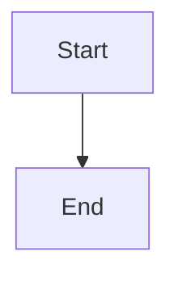

# Built-in MDX & Custom Components

Boltdocs supports a rich set of built-in components directly in MDX without requiring explicit import statements. You can also register custom global components and override HTML tags via `mdx-components.tsx`.

## Built-in Components

### Callouts (`<Callout>`)

Use callouts to highlight important guidelines, warnings, or tips.

```mdx
<Callout variant="tip" title="Pro Tip">
  Use `create-boltdocs` to scaffold your project instantly.
</Callout>
```

#### Variants

- `"info"` (Default blue)
- `"note"` (Muted neutral)
- `"tip"` (Green success)
- `"warning"` (Yellow attention)
- `"danger"` (Red alert)

---

### Grid Cards (`<Cards>` & `<Card>`)

Organize reference blocks into responsive multi-column layouts.

```mdx
import { Settings, BookOpen } from 'lucide-react'

<Cards cols={2}>
  <Card title="Configuration" href="/docs/guides/configuration" icon={<Settings />}>
    Set up theme, plugins, and custom configurations.
  </Card>
  <Card title="Guides" href="/docs/guides" icon={<BookOpen />}>
    Browse comprehensive user tutorials.
  </Card>
</Cards>
```

---

### Tabs (`<Tabs>` & `<Tab>`)

Organize content into switchable tab panels:

```mdx
<Tabs items={[{ label: 'npm' }, { label: 'pnpm' }, { label: 'yarn' }]}>
  <Tab>npm install boltdocs</Tab>
  <Tab>pnpm add boltdocs</Tab>
  <Tab>yarn add boltdocs</Tab>
</Tabs>
```

---

### Timeline (`<Timeline>`)

Display a vertical timeline of events:

```mdx
<Timeline items={[
  { title: 'v3.0', date: '2026-06', description: 'Major release' },
  { title: 'v2.0', date: '2025-12', description: 'Stable release' },
]} />
```

---

### Mermaid Diagrams

Standard `mermaid` code blocks are automatically parsed and rendered as interactive, responsive diagrams when the `@bdocs/plugin-mermaid` plugin is installed:

````markdown

````

The plugin auto-syncs diagrams with light/dark theme preferences.

---

### Math Equations

When the `@bdocs/plugin-math` plugin is installed, wrap LaTeX formatting in single `$` (inline math) or double `$$` (block math) delimiters:

```markdown
The quadratic formula is $-b \pm \sqrt{b^2 - 4ac} \over 2a$.

$$ \sum_{i=1}^{n} i = \frac{n(n+1)}{2} $$
```

Powered by **KaTeX** — zero configuration required.

---

### Code Block Features

#### Code Block Titles

Add titles to code blocks using the `title` attribute:

````markdown
```ts title="boltdocs.config.ts"
import { defineConfig } from 'boltdocs'
export default defineConfig({})
```
````

#### Language Icons

Code blocks automatically show language-specific icons for: TypeScript, JavaScript, React, JSON, CSS, HTML, Markdown, Shell, YAML, Rust, TOML, CSV. Icons are lazy-loaded — pages without code blocks ship zero bytes of icon code.

#### ⚠️ Critical Escape Rule for Backticks

When writing inline code that mentions triple backticks (e.g. to explain how to write a code block), **never** surround it with a single backtick like: `` ` ```mermaid ` ``. This conflicts with the MDX preprocessing parser, which will swallow closing tags (like `</Callout>`).

Always escape inline code with four backticks:

```markdown
Use ```` ```mermaid ```` code blocks to define diagrams.
```

---

## Layout Primitives & State Contract

The layout primitives (`Sidebar`, `OnThisPage`, `Navbar`, `SearchDialog`, `Breadcrumbs`, `PageNav`, `CodeBlock`, `ErrorBoundary`) live in `'boltdocs/primitives'`. They are **style-neutral**: structure + behavior + `data-*` state attributes come from the primitive; colors/borders/sizes belong to the theme. The styled defaults you see out of the box live in `ui-base/` (e.g. `ui-base/sidebar.tsx`, `ui-base/on-this-page.tsx`) and are fully overridable through `className` slots.

State contract (present-when-true attributes):

| Primitive | State attributes | Behavior owned by the primitive |
| --------- | --------------- | -------------------------------- |
| `Sidebar` | `data-active`, `data-open`, `data-collapsible`, `data-depth`, `data-badge` | Collapse/expand groups, active-route detection, scroll-into-view of active item |
| `OnThisPage` | `data-active`, `data-level`, `data-otp-*` | IntersectionObserver scroll tracking, indicator math, auto-scroll of active item |
| `Navbar` | `data-open` (drawer/more) | Mobile drawer, more dropdown, click-outside |
| `Tabs` | `data-selected` | Keyboard roving-tabindex, indicator position |

`Sidebar` slot API: `Root`, `Content`, `Mobile`, `Header`, `Footer`, `Group` (collapsible via `defaultOpen`/`open` + toggle button), `Item`, `Link` (with `data-active` + `aria-current`), `Icon`, `Badge` (`data-badge`). `OnThisPage` slot API: `Root`, `Header`, `Content` (with `fadeClassName`), `List`, `Item` (`data-level`), `Link` (`data-active` + `aria-current`), `Indicator`, `Items`, `Tree` (with `itemClassName`/`linkClassName`/`indicatorClassName`/`contentClassName`/`fadeClassName`). `primitives/link.tsx` is the router `Link`/`NavLink` wrapper (supports `ref` and `data-*` passthrough).

See the docs guide `docs/docs/(guides)/customization/theme-primitives.mdx` for the full theming pattern (the `w-toc`, `w-sidebar`, `top-navbar`, `text-muted`, `border-subtle`, `bg-main` utilities are **theme tokens**, not framework API).

---

## Collection Components (`post.tsx`, `list.tsx`, `layout.tsx`)

For bracket directories (`[blog]`, `[changelog]`), you can provide custom React components:

```text
docs/
  [blog]/
    layout.tsx        ← Wraps the entire collection (header, footer, etc.)
    list.tsx          ← Renders the collection index/pagination page
    post.tsx          ← Renders individual blog posts
    my-first-post.md
```

See the [Collections reference](collections.md) for full details.

---

## Global Custom Components (`mdx-components.tsx`)

To override HTML tags (e.g. custom `h2` classes) or expose your own React components globally in every MDX file, create a file named `mdx-components.tsx` in the root of your project:

```tsx title="mdx-components.tsx"
import type { ComponentType } from 'react'

const mdxComponents: Record<string, ComponentType<any>> = {
  // Override HTML h2 tag
  h2: ({ children, ...props }) => (
    <h2 className="text-2xl font-bold my-4 text-primary" {...props}>
      {children}
    </h2>
  ),

  // Register custom global component
  MyAlert: ({ type, children }) => (
    <div className={`alert alert-${type}`}>{children}</div>
  ),
}

export default mdxComponents
```

---

## Plugin Client UI Slots

Plugins can inject React components into dynamic UI slots via `client.slots`. These slots are provided by the plugin's `client` configuration:

| Slot ID | Location | Purpose |
| --------- | ---------- | --------- |
| `'header:left'` | Left side of navbar | Logo or branding |
| `'header:right'` | Right side of navbar | CTA buttons, version selector |
| `'search:dialog'` | Search dialog | Custom search modal |
| `'sidebar:top'` | Top of sidebar | Navigation helpers |
| `'sidebar:bottom'` | Bottom of sidebar | Footer links |
| `'page:before'` | Before page content | Breadcrumbs, alerts |
| `'page:after'` | After page content | Comments, feedback |

### Plugin Provider Components

Plugins can also wrap the entire React tree with context providers via `client.providers`:

```ts
// Plugin definition
export default createPlugin({
  name: 'my-search-plugin',
  client: {
    providers: ['./components/SearchProvider.tsx'],
  },
})
```

### Custom Head Elements

Plugins can inject `<script>`, `<link>`, `<meta>`, and `<style>` elements into the HTML `<head>`:

```ts
export default createPlugin({
  name: 'my-analytics-plugin',
  client: {
    head: [
      { tag: 'script', attrs: { src: 'https://cdn.analytics.com/script.js', async: true } },
      { tag: 'meta', attrs: { name: 'theme-color', content: '#000000' } },
    ],
  },
})
```
